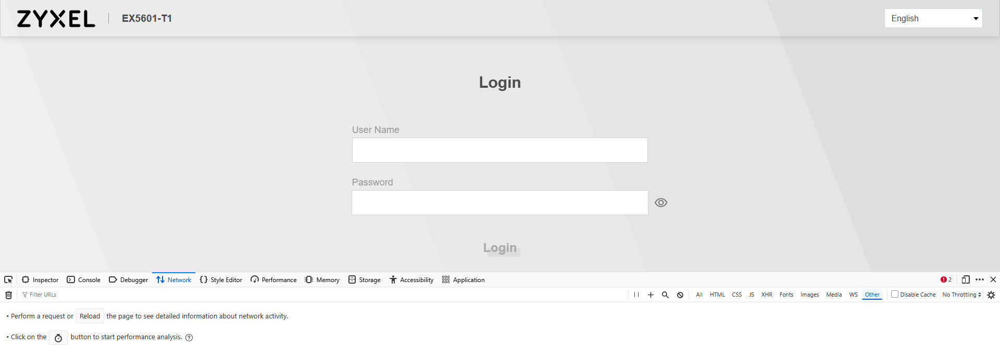
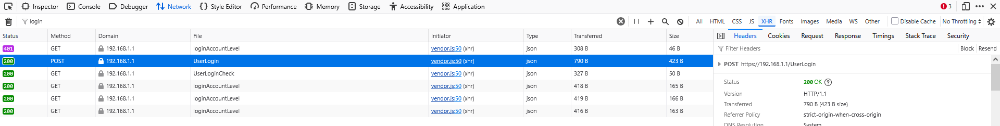

# Zyxel EX5601-T1 – Call Log Export

This project provides a Python utility to log in to a **Zyxel EX5601-T1** router (the default router for Odido subscribers) and automatically export stored call logs.

The script (`requestCallHistory.py`) interacts with the router’s API to authenticate and retrieve the call history.

---

## Prerequisites

* A Zyxel EX5601-T1 router connected to your network.
* Python 3.x installed.
* Access to the router’s web interface credentials (printed on the back of the router).
* Encrypted login values (`content`, `type`, and `iv`) extracted from the router’s web interface.

---

## Obtaining Encrypted Login Parameters

Since the Zyxel EX5601-T1 web client encrypts login data, you must capture the necessary request values before running the script.

1. Open your router’s web interface:

   ```
   https://192.168.1.1
   ```
2. Enter your username and password (found on the back of the router), but **do not log in yet**.
3. Open the browser’s developer tools:

   * **Windows/Linux:** `Ctrl + Shift + I`
   * **macOS:** `Cmd + Option + I`
4. Navigate to the **Network** tab and enable traffic logging (click the record/timer button). 
5. Log in through the web interface.
6. Locate the **POST** request made to the `/userLogin` endpoint. 
7. Right-click the request and export it as a **HAR** file.
8. Open the HAR file and locate the encrypted values under:

   ```
   log.entries.request.postData
   ```
9. Copy the encrypted `content`, `type`, and `iv` values.

---

## Preparing the Script

1. Open the included `body.json.template` file.
2. Paste the extracted encrypted values into the appropriate fields.
3. Save the file as `body.json` (remove the `.template` extension).

---

## Running the Script

Run the Python script to retrieve the call history:

```bash
python .\requestCallHistory.py --body body.json --insecure
```

If successful, the script will generate a file named:

```
CallHistory
```

This file contains the exported call log data from your router.

---

## Notes

* At the time of writing, the exact encryption method used by the Zyxel EX5601-T1 web client is not fully understood. Extracting values directly from the browser’s network logs is currently the most reliable approach.
* This project is intended for **personal use only**. Use responsibly and at your own risk.
* You might wonder what the usecase for this might be? Well This is Odido's stock router they send their customers. Odido includes custom firmware (the same firmware as normal, but with limited features) and this firmware does not provide a way to block certain phonenumbers from calling you. Odido knows this (i called them) but has no solution as of right now. With 2025 at the door and dozens of AI phonecalls coming through, I decided to unplug my telephone line and use this in combination with other software to check who called, so there's you usecase :)